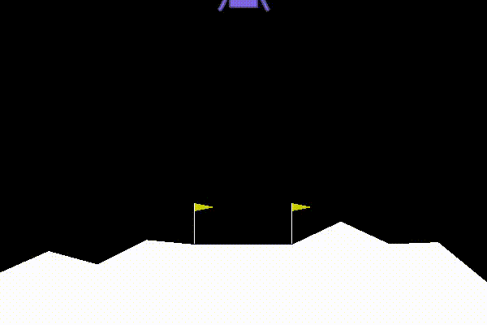
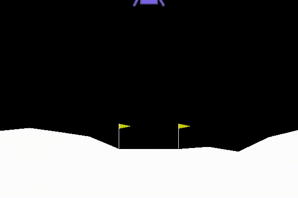
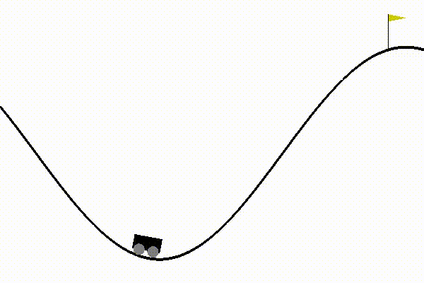
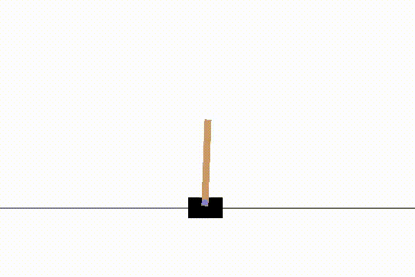
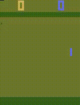
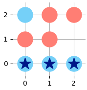
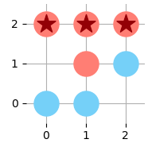
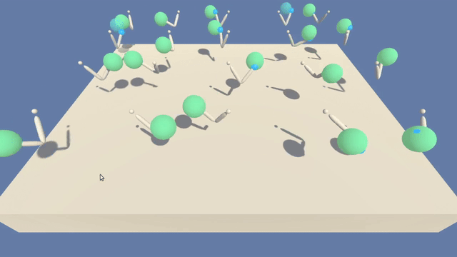

# DRLND
Deep Reinforcement Learning Nanodegree from Udacity

## Contents
### Assignments
#### Part 1: Introduction to Deep Reinforcement Learning
 - Lesson 6: Monte Carlo Methods
    - [OpenAI Gym BlackJackEnv](./assignments/P1-Intro/L6-Monte-Carlo/Monte_Carlo.ipynb)
 - Lesson 7: Temporal-Difference Methods
    - [OpenAI Gym CliffWalkingEnv](./assignments/P1-Intro/L7-Temporal-Difference/Temporal_Difference.ipynb)
 - Lesson 8: OpenAI Gym's Taxi-v2
    - [LabTaxi](./assignments/P1-Intro/L8-Lab-Taxi/lab-taxi.ipynb)
 - Lesson 9: RL in Continuous Spaces
    - [Discretization](./assignments/P1-Intro/L9-RL-in-Continuous-Spaces/Discretization/Discretization.ipynb)
    - [Tile Coding](./assignments/P1-Intro/L9-RL-in-Continuous-Spaces/Tile-Coding/Tile_Coding.ipynb)

#### Part 2: Value-Based Methods
 - Lesson 2: Deep Q-Networks
    - [Deep Q-Learning Algorithm](./assignments/P2-Value-Based-Methods/L2-Deep-Q-Networks/exercise/Deep_Q_Network.ipynb)
    - 
    - 

#### Part 3: Policy-Based Methods
 - Lesson 2: Introduction
    - [Cross Entropy](./assignments/P3-Policy-Based-Methods/L2-Intro-to-Policy-Based-Methods/cross-entropy/CEM.ipynb)
    - 
    - [Hill Climbing](./assignments/P3-Policy-Based-Methods/L2-Intro-to-Policy-Based-Methods/hill-climbing/Hill_Climbing.ipynb)
    - 
 - Lesson 3: Policy Gradient Methods
    - [REINFORCE](./assignments/P3-Policy-Based-Methods/L3-Policy-Gradient-Methods/reinforce/REINFORCE.ipynb)
 - Lesson 4: Proximal Policy Optimization
    - [Pong using REINFORCE](./assignments/P3-Policy-Based-Methods/L4-Proximal-Policy-Optimization/pong-REINFORCE.ipynb)
    - 
    - [Pong using PPO](./assignments/P3-Policy-Based-Methods/L4-Proximal-Policy-Optimization/pong-PPO.ipynb)
    - 

#### Part 4: Multi-Agent Reinforcement Learning
 - Lesson 2: Introduction
    - [Physical Deception](./assignments/P4-Multi-Agent-Reinforcement-Learning/L2-Introduction-to-Multi-Agent-RL/physical-deception/physical-deception.ipynb) `UNSOLVED`
 - Lesson 3: AlphaZero
    - [Tic Tac Toe](./assignments/P4-Multi-Agent-Reinforcement-Learning/L3-Case-Study-AlphaZero/tic-tac-toe/alphazero-TicTacToe.ipynb)
    - 
    - 

### Projects
#### Project 1: Navigation
 - [Navigation](./p1_navigation/Navigation.ipynb)
 - 
 
#### Project 2: Continuous Control
 - [Continuous Control](./p2_continuous-control/Continuous_Control.ipynb)
 - 
