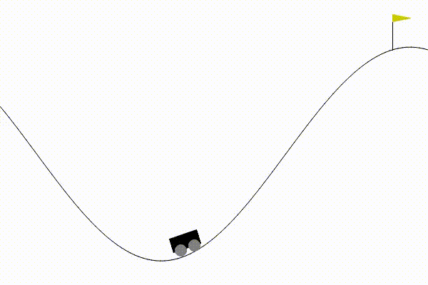
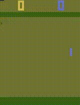
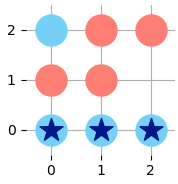
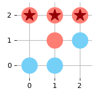
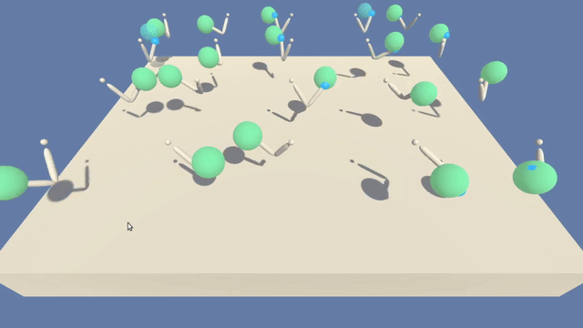
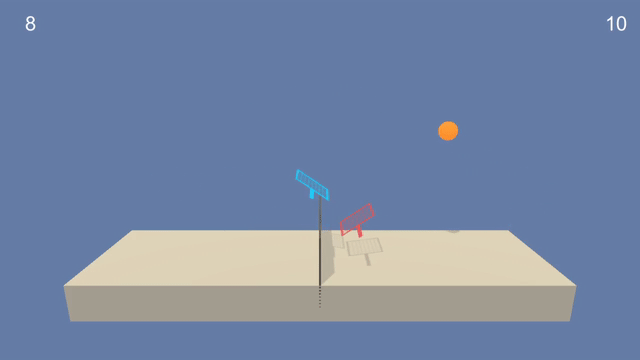

# DRLND
Deep Reinforcement Learning Nanodegree from Udacity. The original course [GitHub repository](https://github.com/udacity/deep-reinforcement-learning).

## Contents
### Assignments
#### Part 1: Introduction to Deep Reinforcement Learning
 - Lesson 6: Monte Carlo Methods
    - [OpenAI Gym BlackJackEnv](./assignments/P1-Intro/L6-Monte-Carlo/Monte_Carlo.ipynb)
 - Lesson 7: Temporal-Difference Methods
    - [OpenAI Gym CliffWalkingEnv](./assignments/P1-Intro/L7-Temporal-Difference/Temporal_Difference.ipynb)
 - Lesson 8: OpenAI Gym's Taxi-v2
    - [LabTaxi](./assignments/P1-Intro/L8-Lab-Taxi/lab-taxi.ipynb)
 - Lesson 9: RL in Continuous Spaces
    - [Discretization](./assignments/P1-Intro/L9-RL-in-Continuous-Spaces/Discretization/Discretization.ipynb)
    - [Tile Coding](./assignments/P1-Intro/L9-RL-in-Continuous-Spaces/Tile-Coding/Tile_Coding.ipynb)

#### Part 2: Value-Based Methods
 - Lesson 2: Deep Q-Networks
    - [Deep Q-Learning Algorithm](./assignments/P2-Value-Based-Methods/L2-Deep-Q-Networks/exercise/Deep_Q_Network.ipynb)
    - 
    - 

#### Part 3: Policy-Based Methods
 - Lesson 2: Introduction
    - [Cross Entropy](./assignments/P3-Policy-Based-Methods/L2-Intro-to-Policy-Based-Methods/cross-entropy/CEM.ipynb)
    - 
    - [Hill Climbing](./assignments/P3-Policy-Based-Methods/L2-Intro-to-Policy-Based-Methods/hill-climbing/Hill_Climbing.ipynb)
    - 
 - Lesson 3: Policy Gradient Methods
    - [REINFORCE](./assignments/P3-Policy-Based-Methods/L3-Policy-Gradient-Methods/reinforce/REINFORCE.ipynb)
 - Lesson 4: Proximal Policy Optimization
    - [Pong using REINFORCE](./assignments/P3-Policy-Based-Methods/L4-Proximal-Policy-Optimization/pong-REINFORCE.ipynb)
    - 
    - [Pong using PPO](./assignments/P3-Policy-Based-Methods/L4-Proximal-Policy-Optimization/pong-PPO.ipynb)
    - 

#### Part 4: Multi-Agent Reinforcement Learning
 - Lesson 2: Introduction
    - [Physical Deception](./assignments/P4-Multi-Agent-Reinforcement-Learning/L2-Introduction-to-Multi-Agent-RL/physical-deception/physical-deception.ipynb) `UNSOLVED`
 - Lesson 3: AlphaZero
    - [Tic Tac Toe](./assignments/P4-Multi-Agent-Reinforcement-Learning/L3-Case-Study-AlphaZero/tic-tac-toe/alphazero-TicTacToe.ipynb)
    - 
    - 

### Projects
#### Project 1: Navigation
 - [Navigation](./p1_navigation/Navigation.ipynb)
 - 
 
#### Project 2: Continuous Control
 - [Continuous Control](./p2_continuous-control/Continuous_Control.ipynb)
 - 

#### Project 3: Collaboration and Competition
 - [Collaboration and Competition](./p3_collab-compet/Tennis.ipynb)
 - 

## Setup

### Intel GPU

Although we are going to use PyTorch 2.7 testing, please follow 
[PyTorch 2.6 Prerequisites for Intel GPUs](https://www.intel.com/content/www/us/en/developer/articles/tool/pytorch-prerequisites-for-intel-gpu/2-6.html)
article to install Intel GPU driver and deep learning essentials.

Tested on the following hardware specification and software version.

__Hardware Specification__
 - CPU: Intel® Core™ Ultra 9 Processor 285K
 - CPU Cores: 24 (8 Performance-cores and 16 Efficient-cores)
 - CPU Threads: 24
 - Memory: 32 GiB
 - GPU: Intel® Arc™ A770 Graphics
 - GPU Memory: 16 GiB
 
__Software Version__
 - Ubuntu 24.04.2 LTS
 - Intel Graphics Compute Runtime [25.05.32567.17](https://github.com/intel/compute-runtime/releases/tag/25.05.32567.17)
 - Intel Deep Learning Essentials 2025.0.2-6
 - Python 3.12.3
 - PyTorch 2.7.0+xpu
 - TorchVision 2.7.0+xpu
 - Gymnasium 1.1.1
 - NumPy 2.1.2
 - Matplotlib 3.10.1
 - Pandas 2.2.3

### Install Requirements

Install required packages.
```
$ sudo apt install swig
```

Create virtual environment.
```
$ python3 -m venv pytorch_arc_env
$ source pytorch_arc_env/bin/activate
$ python -m pip install --upgrade pip
```

Install PyTorch and other required packages.
```
$ pip install torch==2.7 torchvision torchaudio --index-url https://download.pytorch.org/whl/test/xpu
$ cd DRLND
$ pip install --upgrade -r requirements.txt
```

### Test Run

Activate virtual environment and setup variables.
```
$ source pytorch_arc_env/bin/activate

$ source /opt/intel/oneapi/compiler/2025.0/env/vars.sh
$ source /opt/intel/oneapi/umf/0.9/env/vars.sh
$ source /opt/intel/oneapi/pti/0.10/env/vars.sh
```

Detect GPU.
```
$ python -c "import torch; print(torch.xpu.is_available())"
```
```
True
```

### Run

Activate virtual environment and setup variables.
```
$ source pytorch_arc_env/bin/activate

$ source /opt/intel/oneapi/compiler/2025.0/env/vars.sh
$ source /opt/intel/oneapi/umf/0.9/env/vars.sh
$ source /opt/intel/oneapi/pti/0.10/env/vars.sh
```

Run the notebooks.
```
$ cd DRLND
$ jupyter lab
```
