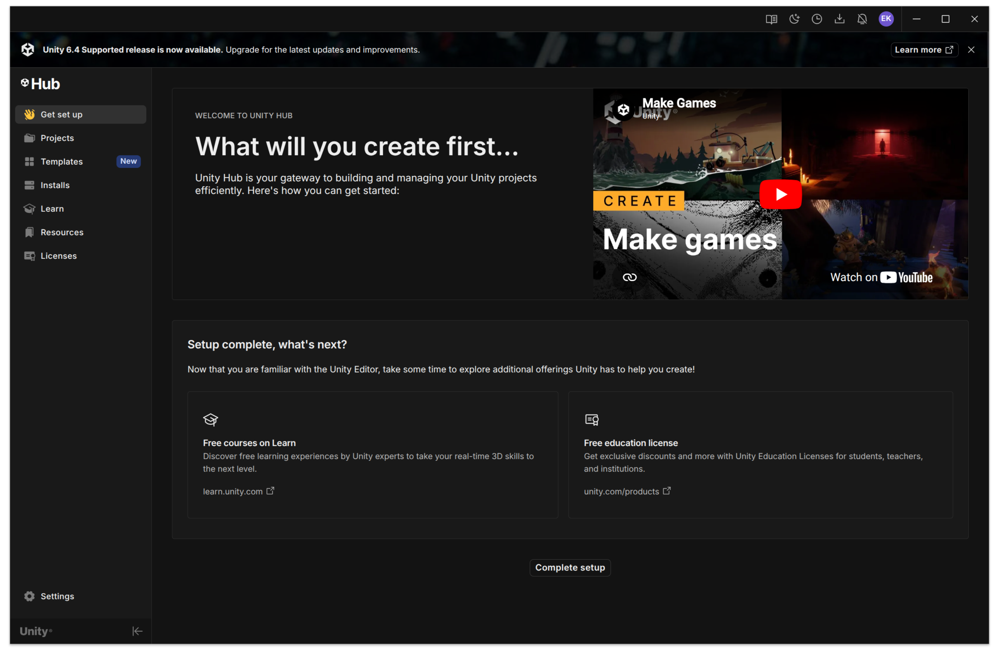
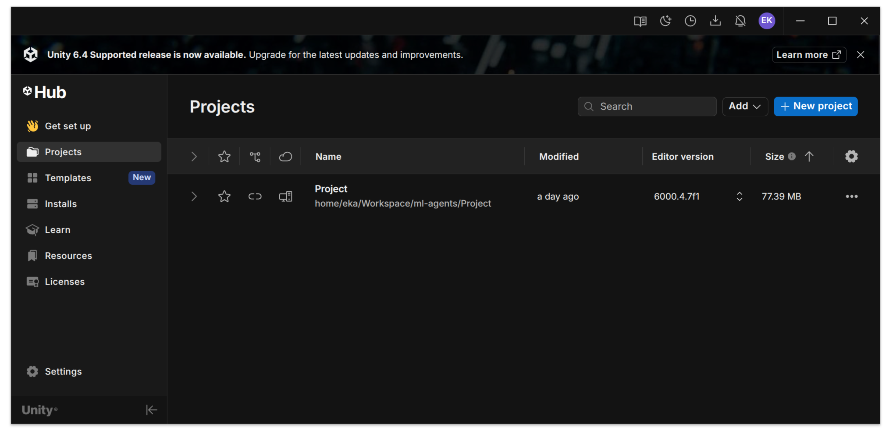
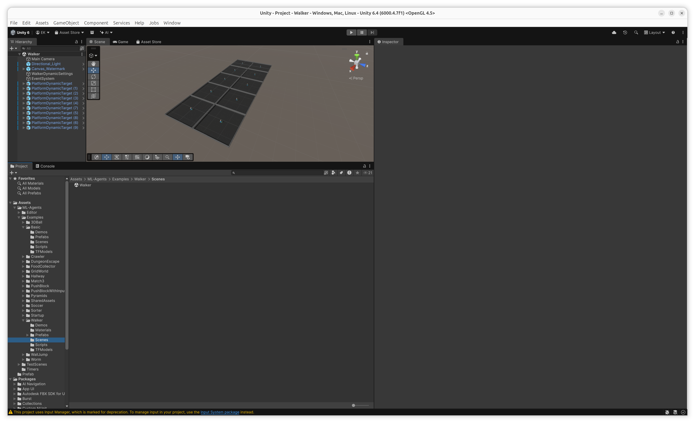
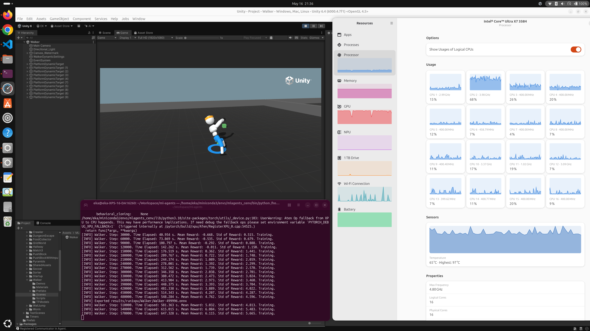
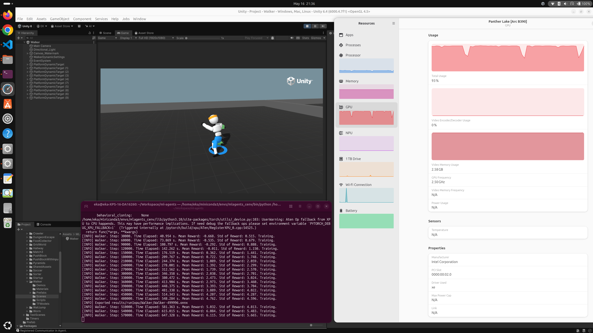

# Setup Unity Machine Learning Agents Toolkit and PyTorch XPU

Tested on the following hardware specification and software version.

Hardware Specification:
 - CPU: Intel® Core™ Ultra X7 Processor 358H
 - CPU Cores: 16 (4 Performance-cores, 8 Efficient-cores, and 4 Low Power Efficient-cores)
 - CPU Threads: 16
 - Memory: 32 GiB
 - iGPU: Intel® Arc™ B390 GPU

Software Version:
 - Ubuntu 26.04 LTS
 - Intel Graphics Compute Runtime 26.22.38646.4
 - Python 3.10.12
 - PyTorch 2.8.0+xpu
 - Unity ml-agents 1.2.0.dev0
 - Unity ml-agents-envs 1.2.0.dev0

## Install Unity Hub

Install Unity Hub using the following commands on Terminal, run it, and create an account.
```
$ sudo apt install curl
$ sudo install -d /etc/apt/keyrings
$ curl -fsSL https://hub.unity3d.com/linux/keys/public | sudo gpg --dearmor -o /etc/apt/keyrings/unityhub.gpg
$ echo "deb [arch=amd64 signed-by=/etc/apt/keyrings/unityhub.gpg] https://hub.unity3d.com/linux/repos/deb stable main" | sudo tee /etc/apt/sources.list.d/unityhub.list
$ sudo apt update
$ sudo apt install unityhub
```



## Install Unity ML Agents using Advanced Installation

Install Miniconda on Terminal.
```
$ wget https://repo.anaconda.com/miniconda/Miniconda3-latest-Linux-x86_64.sh
$ bash Miniconda3-latest-Linux-x86_64.sh
```

Restart the Terminal to run on Miniconda base virtual environment. The prompt should look like the following.
```
(base) ... $
```

Install Python on the new virtual environment.
```
$ conda create -n mlagents_cenv python=3.10.12
$ conda activate mlagents_cenv
```

After activating the virtual environment for Unity ML Agents, the prompt should look like the following.
```
(mlagents_cenv) ... $
```

Download Unity ML Agents.
```
$ git clone --revision=aeb6f7aee8d9b4aa63329476557d94d87c541146 --depth=1 \
  https://github.com/Unity-Technologies/ml-agents.git
```

Install Unity ML Agents.
```
$ cd ml-agents
$ python -m pip install ./ml-agents-envs
$ python -m pip install ./ml-agents
```

Install PyTorch XPU. PyTorch 2.8 is the highest version supported based on 
[this pull request](https://github.com/Unity-Technologies/ml-agents/pull/6251).
```
$ python -m pip install torch==2.8.0+xpu torchvision==0.23.0+xpu torchaudio==2.11.0+xpu \
  --index-url https://download.pytorch.org/whl/xpu
```

## Load Unity ML Agents Project

On Unity Hub, go to `Projects` tab, click on `Add project from disk`, and select the path to `ml-agents/Project`.
Please use the latest Unity version 6.4 (6000.4.7f1) instead of the original version when the project created due to security issue.


## Load Unity ML Agents Scenes

Click on the project to open Unity Engine. This example will load Walker scenes for training and inference later.
Go to `Project` tab, select `Assets > ML-Agents > Examples > Walker > Scenes`, drag `Walker` into `Hierarchy` tab.


## Train Unity ML Agents

Go back to Terminal and run the following command to start the training server.
```
$ mlagents-learn config/ppo/Walker.yaml --run-id=run1xpu --torch-device xpu
```

Then, go to Unity Engine to start the training by clicking the `Play` button on the top-center of the window.
To stop the training, press `Ctrl+c` on the Terminal.


To re-train from scretch, run the command using `--force` parameter.
```
$ mlagents-learn config/ppo/Walker.yaml --run-id=run1xpu --torch-device xpu --force
```

Or, to continue from the previous training, use `--resume` parameter.
```
$ mlagents-learn config/ppo/Walker.yaml --run-id=run1xpu --torch-device xpu --resume
```





## Run Unity ML Agents Inference

To run inference of the trained model, stop the training server using `Ctrl+c`.
Move to Unity Engine and click on `Play` button. The inference will run on CPU only.


## References
 - Unity, _Install the ML-Agents Toolkit_, 16 May 2026, https://docs.unity3d.com/Packages/com.unity.ml-agents@4.0/manual/Installation.html.
 - Ludic Worlds, _Get Started with ML-Agents in Unity - Part 1: Setup & Installation_, 16 May 2026, https://www.youtube.com/watch?v=ZtbjlrmRbyc.
