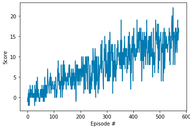

# Implementation

### Q-Network

Q-network consists of two fully connected (FC) hidden layers with 512 nodes connected to 
the input layer and 64 nodes connected to output layer. Both of the FC layers have RELU 
activation function. The input has 37 nodes and the output has 4 nodes. The two hidden 
layers and the RELU activation function are chosen to achieve non-linearity. Whereas, 
the high number of nodes are selected so the model can have better learning capability. 

### Replay Buffer

Replay buffer is useful as one of to ways implemented to remove correlations. It stores 
tuples of state, action, reward, next state and done flag. Each tuple is unique to avoid 
rare events overshadowed by common events. Sampling these experience tuples is done randomly 
in batch. This random sampling is the one that remove correlations.

### Agent

Agents holds Q-table as foundation to perform action based on current state it is in. This 
Q-table is implemented using Neural Networks called Q-network describe above. Another 
way to reduce correlations is by implementing two Q-networks. One that is frequently 
updated and another one that is occasionally updated acting as the solid ground. The
algorithm used for learning is sarsamax.

### Training

With a big environment, discount factor (gamma) for training is set high at 0.99. 
Where is exploration value epsilon start at high value (1.0) but then gradually going 
down to 0.01. The target average score of 13 or higher in 100 episodes window was 
achieved in 473 episodes. The learning progress is shown below.

### Agent Performance

Initially, with a very small exploration value of 0.01, the agent can be trapped in a 
circular state-action loop and cannot go out of the situation. After make it higher at 
0.1, the trained agent performs much batter and can easily achieve score of 13.

### Future Work

This initial training use a massive neural networks just to make sure that the agent 
has the capability to perform well. Reducing the 512 nodes to 256 or 128 as well as the 
64 nodes to 32 or 16 might produce similar result with much efficiency.
